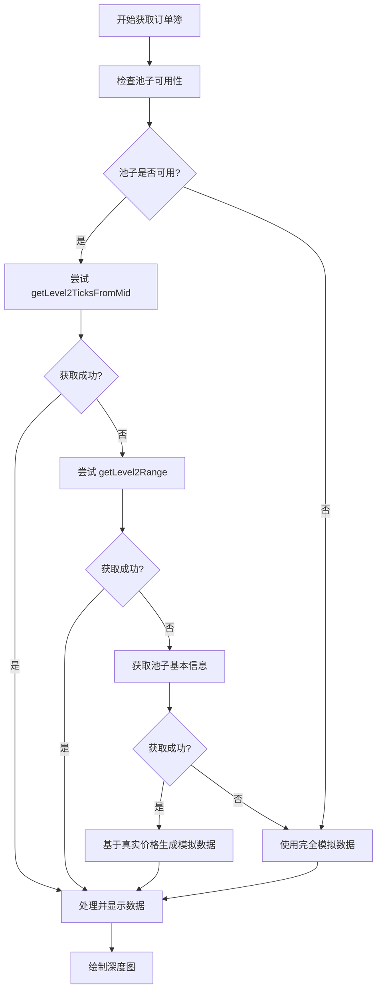

# OrderBook.vue 组件改进说明

## 概述

本文档详细说明了对 `OrderBook.vue` 组件的改进，使其能够真实地与 DeepBook V3 协议交互，获取和展示订单簿数据。

## 主要改进

### 1. 真实的 DeepBook V3 API 集成

#### 使用的 API 方法

根据 DeepBook V3 官方文档，我们实现了以下 API 调用：

1. **getLevel2TicksFromMid(poolKey, ticks)**
   - 获取从中间价格开始的订单簿数据
   - 返回指定数量的价格档位
   - 最优先使用的方法

2. **getLevel2Range(poolKey, priceLow, priceHigh, isBid)**
   - 获取指定价格范围内的订单簿数据
   - 分别获取买单和卖单数据
   - 作为备选方法

3. **midPrice(poolKey)**
   - 获取池子的中间价格
   - 用于验证池子状态和生成价格范围

4. **whitelisted(poolKey)**
   - 检查池子是否在白名单中
   - 用于验证池子的可用性

5. **poolTradeParams(poolKey)**
   - 获取池子的交易参数（手续费等）
   - 用于显示池子详细信息

6. **poolBookParams(poolKey)**
   - 获取池子的账本参数（tick size等）
   - 用于生成更真实的模拟数据

7. **vaultBalances(poolKey)**
   - 获取池子的金库余额
   - 用于显示池子流动性信息

### 2. 多层次的数据获取策略

实现了四层数据获取策略，确保在各种情况下都能显示订单簿：

1. **真实 Level2 数据**：使用 `getLevel2TicksFromMid`
2. **价格范围数据**：使用 `getLevel2Range`
3. **基于真实价格的模拟数据**：使用真实中间价格生成
4. **完全模拟数据**：兜底方案

### 3. 调试和监控功能

#### 调试面板
- 显示池子状态信息
- 显示 API 调用日志
- 实时监控数据获取过程

#### API 调用日志
- 记录所有 API 调用的时间戳
- 显示调用方法、状态和结果
- 支持成功、错误、警告、信息四种状态

#### 池子信息展示
- 白名单状态
- 中间价格
- 交易参数
- 账本参数
- 金库余额

### 4. 改进的错误处理

- 每个 API 调用都有独立的错误处理
- 失败时自动降级到下一个方法
- 详细的错误日志记录
- 用户友好的错误提示

### 5. 增强的用户界面

#### 统计信息扩展
- 总买单数量
- 总卖单数量
- 价差
- 中间价格（如果可用）

#### 响应式设计
- 支持移动设备
- 调试面板自适应布局
- 表格和图表响应式调整

## 技术实现细节

### 客户端初始化

```javascript
const client = new SuiClient({ url: rpcEndpoints[network] });
const dbClient = new DeepBookClient({
  address: '0x0000000000000000000000000000000000000000000000000000000000000000',
  env: network,
  client,
});
```

### 数据获取流程



### 日志系统

```javascript
const addApiLog = (method, status, message) => {
  const timestamp = new Date().toLocaleTimeString();
  apiLogs.value.unshift({
    timestamp,
    method,
    status,
    message,
    type: status === 'success' ? 'success' : status === 'error' ? 'error' : 'info'
  });
};
```

## 支持的交易对

- SUI/USDC
- DEEP/SUI  
- DEEP/USDC

每个交易对都有相应的基准价格和参数配置。

## 使用方法

1. 选择交易对
2. 点击"刷新订单簿"按钮
3. 查看订单簿表格和深度图
4. 可选择显示调试信息查看详细的 API 调用过程

## 注意事项

1. **网络连接**：需要稳定的网络连接到 Sui 主网
2. **API 限制**：某些 DeepBook V3 API 可能有调用频率限制
3. **数据实时性**：订单簿数据可能不是完全实时的
4. **兼容性**：确保使用最新版本的 `@mysten/deepbook-v3` SDK

## 未来改进方向

1. **WebSocket 支持**：实现实时订单簿更新
2. **更多交易对**：支持更多的交易对
3. **高级图表**：添加更多的图表类型和指标
4. **性能优化**：优化大量数据的处理和渲染
5. **用户配置**：允许用户自定义显示参数

## 相关文档

- [DeepBook V3 官方文档](https://docs.sui.io/standards/deepbookv3)
- [DeepBook V3 SDK 文档](https://docs.sui.io/standards/deepbookv3-sdk)
- [Sui TypeScript SDK](https://sdk.mystenlabs.com/typescript)